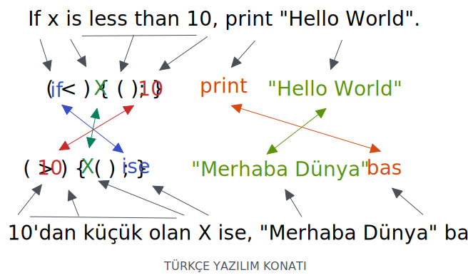

# 📜 Terimler

Ad:

Ad başı:

Ad ayağı:

Edim:

Edim başı:

Edim ayağı:

Ek:

Ek başı:

Ek ayağı:

Türetme eki:

Çekim eki:

Söz:

Söz başı:

Söz ayağı:

Sözcük:

Sözcük başı:

Sözcük ayağı:

Taban:

Taban başı:

Taban ayağı:

Kök:

Kök başı:

Kök ayağı:

Gövde:

Gövde başı:

Gövde ayağı:

